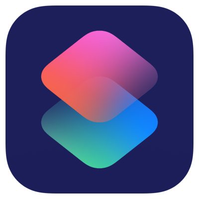
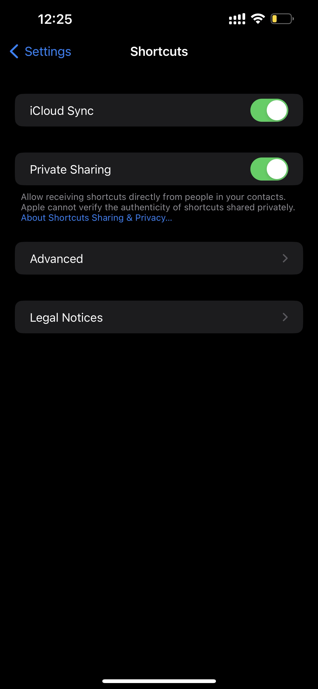
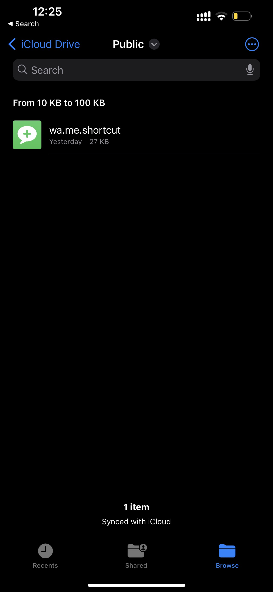
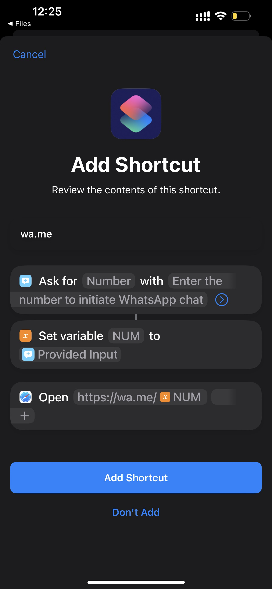
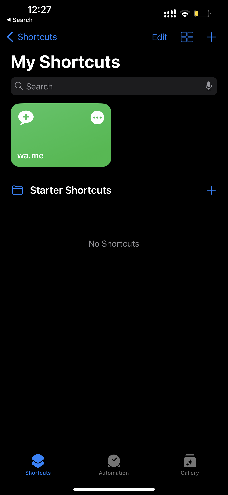
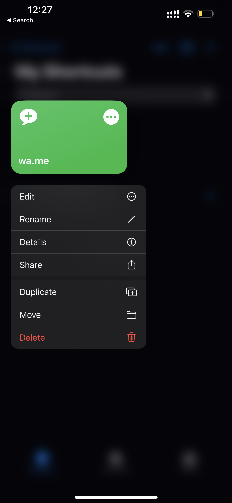
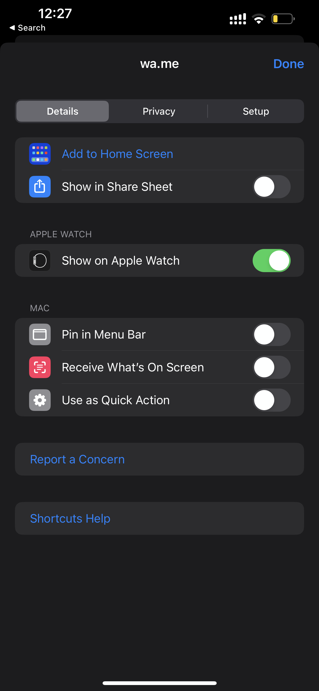
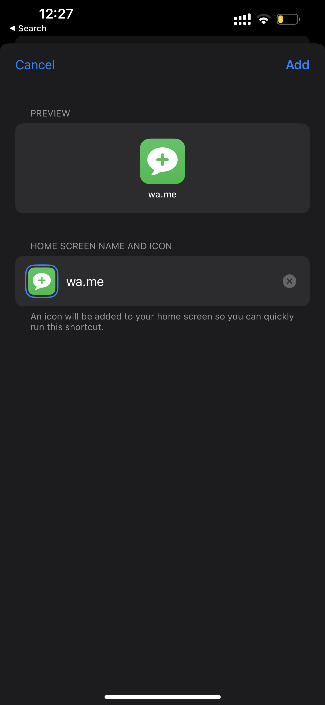
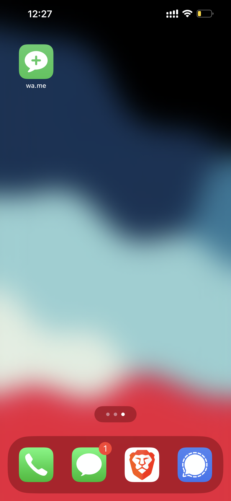
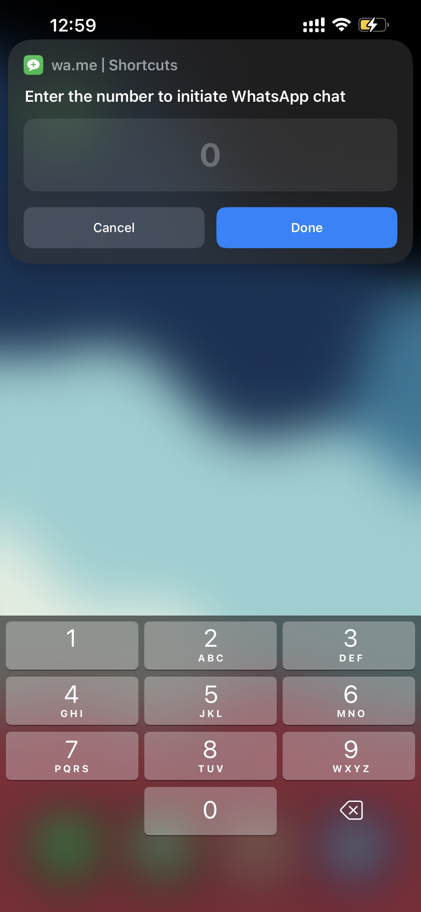

 
# wa.me ios shortcut

## What is it?
This is a shortcut for the iOS Shortcuts app that allows you to send a message to a WhatsApp contact without having to save the contact in your phone.

---
## Pre-requisites

1. Enable privacy sharing for the Shortcuts app: **go to Settings > Shortcuts > enable "privacy sharing"**

2. Download the shortcut from [here](https://github.com/psadi/wa.me/raw/main/wa.me.shortcut)

---
## How to use it?

1. Open the downloaded shortcut and click on add shortcut

2. Go-to my shortcuts inside the shortcuts app and long press wa.me shortcut

3. Click on share option

4. Click on add to home screen and select Add (or) add it as a widget (can be configured to add it as watch shortcut too!!)

5. Now you can use the shortcut from your home screen

You're done! Now you can send a message to a WhatsApp contact without having to open the app!

---

## **[LICENSE](./LICENSE)**

[psadi/wa.me](https://github.com/psadi/wa.me) is free: you can redistribute it and/or modify
it under the terms of the GNU General Public License as published by
the Free Software Foundation, version 3 of the License

[psadi/wa.me](https://github.com/psadi/wa.me) is distributed in the hope that it will be useful,
but WITHOUT ANY WARRANTY; without even the implied warranty of
MERCHANTABILITY or FITNESS FOR A PARTICULAR PURPOSE. See the
GNU General Public License for more details.

You should have received a copy of the GNU General Public License
along with [psadi/wa.me](https://github.com/psadi/wa.me). If not, see <https://www.gnu.org/licenses/>.

---

Give a ⭐️ if you like this project! 😄